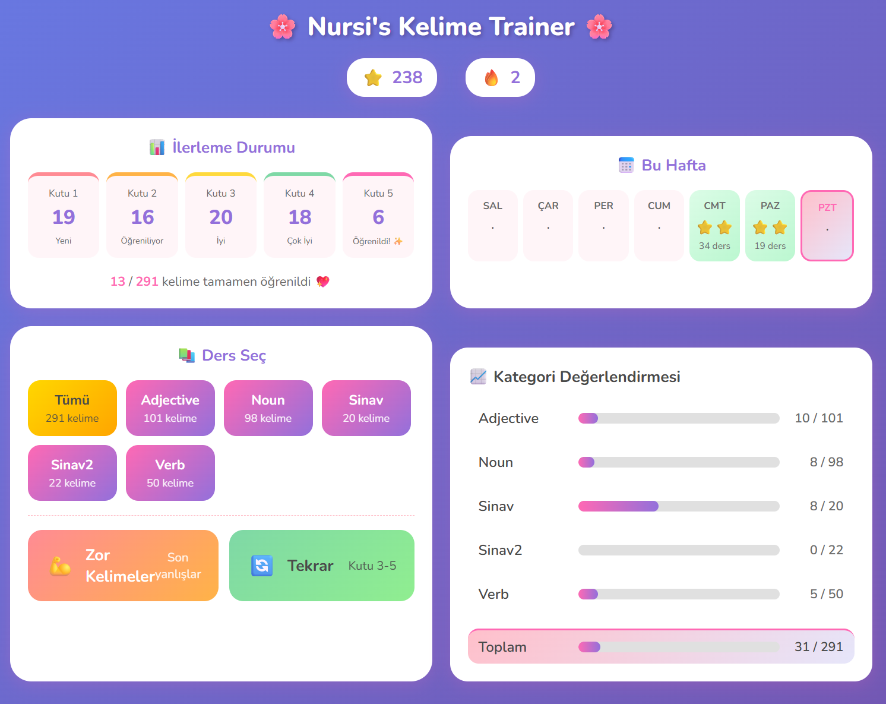

# Kelime Trainer

**Leitner aralıklı tekrar sistemi** kullanan web tabanlı Türkçe-İngilizce kelime öğrenme uygulaması. Kelimeler öğrendikçe 5 kutu arasında ilerler - doğru cevaplar kelimeleri yukarı taşır, yanlış cevaplar kutu 1'e geri gönderir.

**Özellikler:**
- **Akıllı tekrar** - Zorlandığın kelimeler daha sık karşına çıkar
- **Çoklu eğitim modları** - Hızlı dersler, zor kelime pratiği ve tekrar oturumları
- **İlerleme takibi** - Yıldızlar, seriler, başarılar ve haftalık aktivite
- **Yönetici paneli** - Kelimeleri manuel veya toplu dosya yükleme ile ekle
- **Mobil uyumlu** - Her cihazda çalışır

# Kelime Setleri

/vocabulary/ klasörü, en yaygın fiiller, sıfatlar ve isimler içeren üç örnek girdi dosyası içerir.
Kurulumdan sonra, admin sayfasına (localhost:3000/admin) gidin ve toplu yükleme kullanın.


---

# Vocabulary Trainer

A web-based Turkish-English vocabulary learning app using the **Leitner spaced repetition system**. Words progress through 5 boxes as you learn them - correct answers move words up, wrong answers send them back to box 1.

**Features:**
- **Smart repetition** - Words you struggle with appear more often
- **Multiple training modes** - Quick lessons, weak word practice, and review sessions
- **Progress tracking** - Stars, streaks, achievements, and weekly activity
- **Admin panel** - Add words manually or bulk upload from text files
- **Mobile-friendly** - Works on any device

---

# Vocabulary

The folder /vocabulary/ contains three example input files, with the most common verbs, adjectives and nouns.
After installation, just go to the admin page (localhost:3000/admin) and use bulk upload.

## Screenshots




## Deployment Guide

### Prerequisites

- **Node.js** v20 or higher
- **npm** (comes with Node.js)
- **Docker** (for containerized deployment)

---

## Option 1: Running Locally

### 1. Install Dependencies

```bash
cd vocab-trainer
npm install
```

This will install:
- `express` - Web server
- `better-sqlite3` - SQLite database
- `multer` - File upload handling

### 2. Start the Server

**Production mode:**
```bash
npm start
```

**Development mode (auto-restart on file changes):**
```bash
npm run dev
```

### 3. Access the Application

- **Learner interface:** http://localhost:3000
- **Admin panel:** http://localhost:3000/admin

### 4. Data Location

By default, data is stored in `./data/`:
- `data/vocab.db` - SQLite database
- `data/uploads/` - Temporary file uploads

To use a custom data directory, set the `DATA_DIR` environment variable:
```bash
DATA_DIR=/path/to/data npm start
```

---

## Option 2: Docker Deployment

### 1. Build the Docker Image

```bash
cd vocab-trainer
docker build -t vocab-trainer:latest .
```

### 2. Run the Container

```bash
docker run -d \
  --name vocab-trainer \
  -p 3000:3000 \
  -v /path/to/your/data:/app/data \
  --restart unless-stopped \
  vocab-trainer:latest
```

**Parameters explained:**
| Parameter | Description |
|-----------|-------------|
| `-d` | Run in background (detached) |
| `--name vocab-trainer` | Container name |
| `-p 3000:3000` | Map port 3000 |
| `-v /path/to/your/data:/app/data` | Persist database outside container |
| `--restart unless-stopped` | Auto-restart on reboot |

### 3. View Logs

```bash
docker logs -f vocab-trainer
```

### 4. Stop/Remove Container

```bash
docker stop vocab-trainer
docker rm vocab-trainer
```

---

## Option 3: Unraid Deployment

### Method A: Using Docker Hub (Recommended)

First, push your image to Docker Hub:

```bash
# Login to Docker Hub
docker login

# Tag the image
docker tag vocab-trainer:latest yourusername/vocab-trainer:latest

# Push to Docker Hub
docker push yourusername/vocab-trainer:latest
```

Then in Unraid:
1. Go to **Docker** tab
2. Click **Add Container**
3. Fill in the settings (see below)

### Method B: Build on Unraid

1. Copy the project files to your Unraid server
2. SSH into Unraid and navigate to the project folder
3. Build the image:
   ```bash
   docker build -t vocab-trainer:latest .
   ```

### Unraid Container Settings

| Setting          | Value                                                             |
| ---------------- | ----------------------------------------------------------------- |
| **Name**         | vocab-trainer                                                     |
| **Repository**   | vocab-trainer:latest (local) or yourusername/vocab-trainer:latest |
| **Network Type** | Bridge                                                            |
| **Port Mapping** | Host: 3000 → Container: 3000                                      |
| **Path Mapping** | Host: /mnt/user/appdata/vocab-trainer → Container: /app/data      |

### Unraid Docker Template (XML)

You can also create a template. Save this as `/boot/config/plugins/dockerMan/templates-user/my-vocab-trainer.xml`:

```xml
<?xml version="1.0"?>
<Container version="2">
  <Name>vocab-trainer</Name>
  <Repository>vocab-trainer:latest</Repository>
  <Registry>https://hub.docker.com/</Registry>
  <Network>bridge</Network>
  <Privileged>false</Privileged>
  <Support/>
  <Overview>Turkish-English vocabulary trainer with Leitner spaced repetition system.</Overview>
  <Category>Education:</Category>
  <WebUI>http://[IP]:[PORT:3000]</WebUI>
  <Icon>https://raw.githubusercontent.com/linuxserver/docker-templates/master/linuxserver.io/img/books-icon.png</Icon>
  <ExtraParams>--restart unless-stopped</ExtraParams>
  <DateInstalled></DateInstalled>
  <Config Name="Web UI Port" Target="3000" Default="3000" Mode="tcp" Description="Web interface port" Type="Port" Display="always" Required="true" Mask="false">3000</Config>
  <Config Name="Data" Target="/app/data" Default="/mnt/user/appdata/vocab-trainer" Mode="rw" Description="Database and uploads" Type="Path" Display="always" Required="true" Mask="false">/mnt/user/appdata/vocab-trainer</Config>
</Container>
```

---

## Accessing the Application

Once deployed:

| Interface | URL |
|-----------|-----|
| **Learner** | `http://your-server-ip:3000` |
| **Admin** | `http://your-server-ip:3000/admin` |

---

## Backup

The only data you need to backup is the `data/` folder:
- `vocab.db` - Contains all words and learning progress

```bash
# Example backup command
cp /mnt/user/appdata/vocab-trainer/vocab.db /mnt/user/backups/vocab-trainer-$(date +%Y%m%d).db
```

---

## Updating

### Local/Docker:
```bash
# Pull latest code
git pull

# Rebuild container
docker build -t vocab-trainer:latest .

# Restart container
docker stop vocab-trainer
docker rm vocab-trainer
docker run -d --name vocab-trainer -p 3000:3000 -v /path/to/data:/app/data --restart unless-stopped vocab-trainer:latest
```

### Unraid:
1. Rebuild the image or pull from Docker Hub
2. Click "Apply" on the container to restart with new image

---

## Troubleshooting

### Port already in use
Change the port mapping: `-p 3001:3000` to use port 3001 instead.

### Database permission issues
Ensure the data directory is writable:
```bash
chmod -R 755 /mnt/user/appdata/vocab-trainer
```

### Container won't start
Check logs for errors:
```bash
docker logs vocab-trainer
```

### Reset all data
Stop the container and delete `vocab.db`:
```bash
rm /mnt/user/appdata/vocab-trainer/vocab.db
```
The database will be recreated on next start.

###########################################
###########################################
###########################################
###########################################
